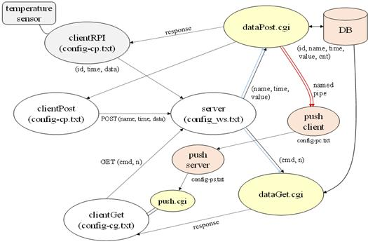

라즈베리파이를 통한 간단한 IoT 시스템 구현
============
>프로젝트의 목표는 C언어를 사용하여 센서, 서버, 모니터 프로그램으로 구성된 간단한 IoT 시스템을 구현하는 것이다. POSIX표준이 제공되는 환경을 기반으로 수행하며 HTTP프로토콜을 이용하여 웹 서버와 클라이언트들 간 통신을 이룬다. 센서에서 측정된 데이터는 데이터베이스에 저장되며, 클라이언트는 명령어를 사용하여 데이터베이스에 저장된 데이터를 확인 할 수 있다. 임계치 값을 넘어가는 온도 또는 습도가 측정되면 사용자에게 알림을 보내는 기능과, 다수의 클라이언트가 보내는 요청을 처리할 수 있도록 하는 서버의 기능을 구현하여 성능을 높인다. 이 후 추가적으로 스마트폰을 라즈베리파이와 sensor의 대용으로 사용하는 기능과 clientGet 프로세스를 web page형태로 출력하는 기능을 구현하는 것이다.

개발 기간 및 환경
-------------
* 기간 : 2016.09 ~ 2016.11
* OS : Linux Ubuntu, Rasbian
* Language : C
* Library : MySQL
* Hardware : RasberryPi
* Tools : Oracle VM VirtualBox

개발 내용
-------------
* POSIX표준이 제공되는 환경에서 수행되며 HTTP프로토콜을 이용하여 웹 서버와 클라이언트들 간 통신을 이룬다. 센서에서 측정된 온·습도를 서버로 전송하고, 데이터를 전달받은 서버는 데이터베이스에 데이터를 저장하며 클라이언트는 명령어를 통해 데이터베이스에 저장된 값을 확인할 수 있다. 전달받은 데이터의 값이 임계치 값을 넘는다면 클라이언트에게 push alarm을 보내주어 능동적인 서버가 될 수 있도록 하였다. 다수의 클라이언트에게 요청이 발생할 때 처리할 수 있도록 thread pool을 만들어 server의 성능을 높였다. 

시스템 구성도
-------------
